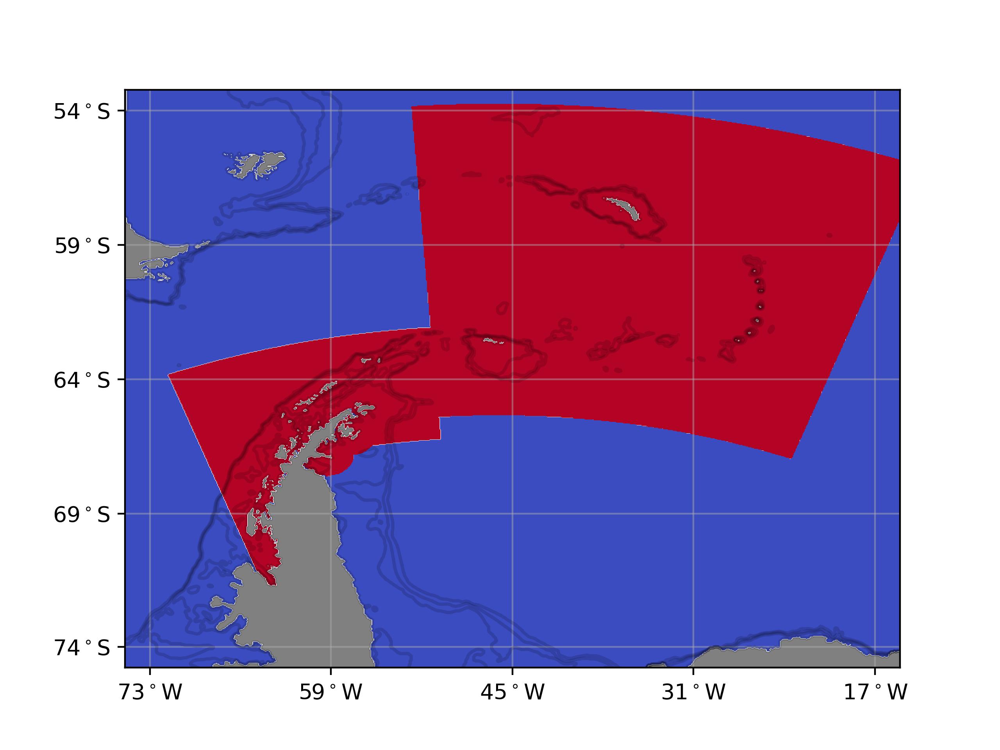
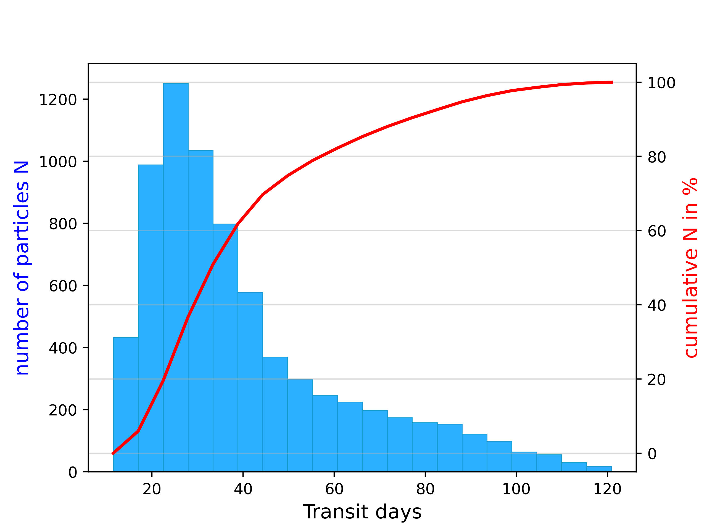

# Krillmod
#### Short description of project: 
Description of modules used to analyse trajectory data stored in netcdf format (``trajectory.nc``). The modules
are briefly summarised before the main ``krillmod.py`` file is detailed. I also go into detail on how 
other modules work in the background.
## Modules:
``krillmod.py``: Main python file for calling modules used in the analysis of trajectory.nc data.\
``import_settings.py``: Stores directories and file names in a dictionary, with settings for local and remote directories.\
``get_trajectory.py``: Functions for accessing and pre-processing trajectory netcdf data stored with CF conventions.\
``analyse_trajectory.py``: Functions for analysing trajectory data accessed with ``get_trajectory.py``.\
``plot_trajectory.py``: Module with functionality for plotting output from ``analyse_trajectory.py``.

### Module ``krillmod.py``:
Firstly, a shapefile is specified with `shape_name`, used to track individuals movements in and out of areas. A
simulation folder is specified with `sim_folder` for keeping track of the scenarios simulated, in this case based on 
year simulated. A `comp_node` defines whether scripts are meant to be run locally or remotely. These arguments are 
passed to `locate_folders` which produces the dictionary `list_dir` as output, which tracks folders used in the 
analysis with keys e.g. `list_dir['depth_file']`:
````python
# Define directories
shape_name = 'ssmusPolygon.shp'
sim_folder = '2016'
comp_node = 'local'
list_dir = locate_folders(comp_node, sim_folder, shape_name)
````
Function sim_account takes `list_dir` as argument and prints key information about the simulation scenario in a text 
file named `sim_summary.txt`, stored in the simulation folder:
````python
# Simulation summary:
sim_account(list_dir)
````

### Module ``import_settings.py``:
* Function ``locate_folders`` accepts arguments for specifying whether the computation node is local or 
remote (``comp_node``), the name of the simulation folder (``sim_folder``) and the ``.shp`` shapefile used for 
subsets of individuals (``shape_name``). These inputs as well as directory specifications in locate_folders function, 
are used to create a dictionary (``list_dir``) of directories for ease of usage:
    ```
    list_dir = locate_folders(comp_node, sim_folder, shape_name)
    ```
* Within ``locate_folders``, the directory for saving analysis output (``save_folder``), containing the trajectory.nc 
file (``traj_folder``) and folder with shape files (``shape_file``) should be specified by the user, depending on 
whether the script is being run locally or on a remote server. Note that the shape folder should also contain a ``.shx`` 
file necessary for reading many ``.shp`` files.
* Finally, the trajectory file (``trajectory.nc``), regional file (intermediate netcdf file named ``regions.nc`` 
described below), a file with simulation timestamps (``time.npy``) and a file with bottom depth data (``depth.npy``) are
all added to ``list_dir`` or first, created with ``os.mkdir()`` locally or ``os.system('mkdir ')`` on a linux server.


### Module ``get_trajectory.py``:
* Function `store_regions` first checks that ``poly2grid.npy`` exists, and if not it is created to store all polygons 
indices defined in the shapefile onto grid coordinates in the domain. The red areas in the image below show grid cells assigned a polygon value > 0 
(maybe add image with MPA, from: https://github.com/ccamlr/data):



* The `store_regions` function then cycles through each individual coordinate and checks which polygon they are found for each time step, 
furnishing the `in_region` matrix. If the individual is not in any of the polygons extracted from the shapefile, 
a zero is inserted. The `in_region` matrix, along with other data from `trajectory.nc` are stored in `regions.nc` file 
that is used in further analysis.
* In addition to `store_regions`, `get_times`and `get_depth`are called from import settings to store time stamps and
bathymetric data in the simulation folder for ease of use.

### Module `analyse trajectory`:
* Used to analyse data based on start positions of particles and then save intermediate `.npy` files for plotting. The 
functions `ssmu_start` and `ssmu_target` are hard coded to subset individuals moving from region A to B. The various 
analyses called in `lagrangian_analysis` use keys for the areas specified.

### Module `plot_trajectory.py`:
* Plots for transit time distributions between areas, for example:



* Animations for particles transported between regions, for example:


